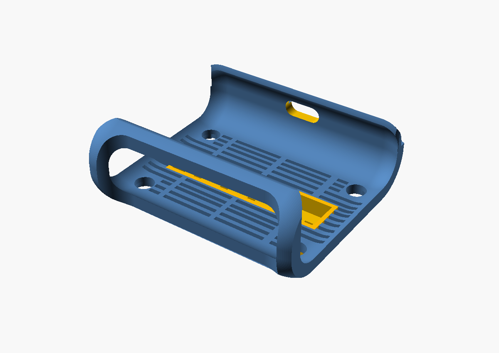
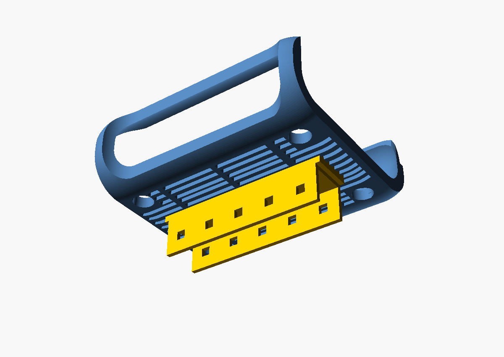

# Beryl AX HomeRacker Sleeve

[OpenSCAD](https://openscad.org/) source for adapting a
[GL.iNet Beryl AX](https://www.gl-inet.com/products/gl-mt3000/) holster to a
[HomeRacker](https://github.com/kellerlabs/homeracker) bar.

The model imports [`GL-INET-BERYL-AX-HOLSTER.stl`](reference/GL-INET-BERYL-AX-HOLSTER.stl)
at millimeter scale, adds a bottom-mounted HomeRacker sleeve, projects the
HomeRacker channel clearance up through the holster for cooling and optional
pin access, and includes a small side window for the device status light.

This is an OpenSCAD modification of the exported STL from
[`GL-INET-BERYL-AX-HOLSTER` by `DunknDonuts`](https://makerworld.com/en/models/428474-gl-inet-beryl-ax-holster),
not an edit of the upstream
[Onshape source CAD](https://cad.onshape.com/documents/4fd11188d706b52e56b15526/w/7970faa89563f7f57c9aa723/e/5b438853887219bc6ade6645).

## Status

This is currently in a rack I use for transporting a setup portably.

Published print profile:
[Beryl AX HomeRacker Sleeve on MakerWorld](https://makerworld.com/en/models/2776106-beryl-ax-homeracker-sleeve#profileId-3084506)

## Preview





## Requirements

- `make`
- `uv`

OpenSCAD and SCAD library dependencies are installed and checked through
`scadm`.

## Quick Start

```sh
make sync
make install
make build
```

The default build writes:

- `renders/beryl_ax_homeracker_sleeve.stl`
- `renders/beryl_ax_homeracker_sleeve.png`

Curated README preview images are kept under `docs/images/`.

## GitHub Release STL

GitHub Actions renders `renders/beryl_ax_homeracker_sleeve.stl` on every push
and pull request, then uploads it as a workflow artifact.

To publish a release STL, push a version tag:

```sh
git tag v0.1.0
git push origin v0.1.0
```

The workflow creates or updates that GitHub Release and attaches the STL.

## Tooling

This repo uses `uv` for Python tooling and `scadm` for OpenSCAD setup and
dependency management.

- `make sync`: install Python tooling into `.venv/`
- `make install`: install OpenSCAD and SCAD dependencies through `uv run scadm install`
- `make check`: check the scadm-managed OpenSCAD/dependency install
- `make render`: render the complete modified sleeve model to STL
- `make png`: render a preview PNG
- `make build`: run setup and render both STL and PNG outputs
- `make clean`: remove generated render/export files

## Source Layout

Main OpenSCAD source:

```text
models/beryl_ax_homeracker_sleeve/parts/beryl_ax_homeracker_sleeve.scad
```

Reference mesh:

```text
reference/GL-INET-BERYL-AX-HOLSTER.stl
```

Upstream holster references:

- MakerWorld: [`GL-INET-BERYL-AX-HOLSTER` by `DunknDonuts`](https://makerworld.com/en/models/428474-gl-inet-beryl-ax-holster)
- Source CAD: [Onshape document](https://cad.onshape.com/documents/4fd11188d706b52e56b15526/w/7970faa89563f7f57c9aa723/e/5b438853887219bc6ade6645)

## Current Model

- Imports `reference/GL-INET-BERYL-AX-HOLSTER.stl`
- Scales the imported mesh by `1000` so it matches slicer dimensions
- Adds a 5-hole HomeRacker sleeve along the bottom
- Cuts matching 4 mm lock-pin holes through the sleeve side walls and roof
- Adds a top reinforcement frame around the sleeve channel opening
- Projects the HomeRacker channel clearance upward through the holster for cooling and optional lock-pin access
- Cuts a pill-shaped light window into the `+Y` side wall

## Key Parameters

The model is OpenSCAD Customizer-friendly. The most useful controls are listed
below. Defaults are shown as the SCAD expressions used in source.

| Parameter | Default | Purpose |
| --- | ---: | --- |
| `part_mode` | `0` | `0` complete model, `1` holster/reference only, `2` sleeve only |
| `sleeve_holes` | `5` | Number of HomeRacker lock-pin positions |
| `sleeve_rotation` | `90` | Sleeve orientation in degrees |
| `sleeve_wall` | `2` | Sleeve side-wall thickness |
| `sleeve_roof_thickness` | `2` | Sleeve roof thickness |
| `sleeve_embed_depth` | `0-2.8` | Vertical sleeve placement relative to the holster bottom |
| `top_reinforcement_wall` | `2` | Wall thickness of the reinforcement frame |
| `top_reinforcement_height` | `5+2.8` | Height of the reinforcement frame |
| `light_window_center` | `[0, 50, 20]` | Center point of the pill-shaped light window |
| `light_window_width` | `18` | Horizontal pill-window width |
| `light_window_height` | `8` | Pill-window height |
| `light_window_depth` | `18` | Cutter depth through the side wall |

HomeRacker conventions used here include 15 mm base units, 0.2 mm tolerance,
and 4 mm lock-pin holes.

## Release Checklist

Before publishing a release artifact:

```sh
make build
```

OpenSCAD should report the rendered model as manifold. Inspect
`renders/beryl_ax_homeracker_sleeve.png`, then use
`renders/beryl_ax_homeracker_sleeve.stl` as the export artifact.

## License

The HomeRacker sleeve and OpenSCAD adaptation work in this repository are
released under the Creative Commons Attribution-ShareAlike 4.0 International
license. See `LICENSE`.

The base Beryl AX holster design is
[`GL-INET-BERYL-AX-HOLSTER` by `DunknDonuts`](https://makerworld.com/en/models/428474-gl-inet-beryl-ax-holster).
See `NOTICE` for source attribution.
